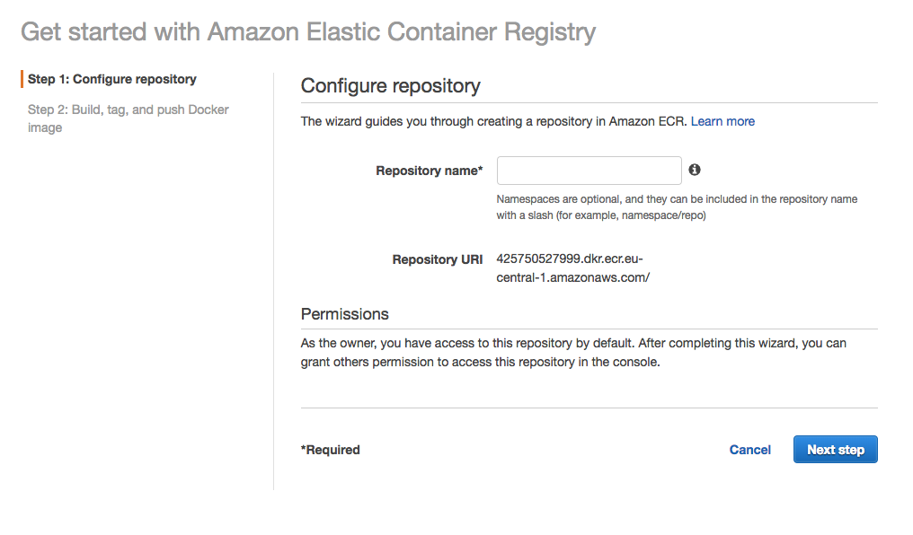

# Elastic Container Service Example

## Requirements

### Docker/Docker-Compose
First install [Docker](https://docs.docker.com/install/) and Docker-Compose for easy
iteration on getting the Docker image right.

### Check everything is working:

#### For local development:

`npm start`

You should be able to access the demo express app at: "http://localhost:3000"

#### For local development using docker-compose:

`docker-compose up`

You should be able to access the demo express app at: "http://localhost"

### elastic-ecs-cli

You will also need the ECS command line tool `ecs`.

[For instructions on installing it:](https://docs.aws.amazon.com/AmazonECS/latest/developerguide/ECS_CLI_installation.html)

### Elastic Container Repository (ECR)

Setup an image repository. Login to your AWS console and go to Services -> Elastic
Container Service -> Repositories.



Name it and create it.

After that, you can login (Change the region if needed)

```
$(aws ecr get-login --no-include-email --region eu-central-1)
```

### Build the container

```
docker build -t <repo-name> .
```

### Tag the image

```
docker tag <repo-name>:latest <repo-uri>/<repo-name>:latest
```

Where `repo-name` is the name you gave the ECR. And `repo-uri` is the URI provided in
the Console. Services -> ECS -> ECR -> Choose your repo

### Push the image

```
docker push <repo-uri>/<repo-name>:latest
```

You should get something like:

```
#Output
The push refers to repository [<repo-uri>]
latest: digest: sha256:fb1e40e2f34e14b5a5f4ba1811d3ba7bd48c1a1d4beb44686b78afa4e83760ac size: 1787
```

### Create a new Cluster


```
ecs-cli configure --cluster ec2-tutorial --region us-east-1 --default-launch-type EC2 --config-name ec2-tutorial
```

#### Create a profile:

```
ecs-cli configure profile --access-key <AWS_ACCESS_KEY>  --secret-key <AWS_SECRET_ACCESS_KEY> --profile-name ec2-tutorial
```

### Create the Cluster

This creates an empty cluster and a VPC configured with two public subnets.


```
ecs-cli up --keypair <your-keypair-name> --capability-iam --size 2 --instance-type t2.medium --cluster-config ec2-tutorial
```


```
#Outputs
INFO[0001] Created cluster                               cluster=testcluster region=eu-central-1
INFO[0001] Waiting for your cluster resources to be created...
INFO[0001] Cloudformation stack status                   stackStatus=CREATE_IN_PROGRESS
VPC created: <THE-VPC-ID>
Subnet created: subnet-0c025649881bf90c6
Subnet created: subnet-0fd9dc9ed3750c0d4
Cluster creation succeeded.
```


#### Launch Cluster

```
ecs-cli compose up --create-log-groups --cluster-config ec2-tutorial
```


```
version: '3'
services:
  web:
    image: <ecr-uri>/<repo-name>:latest
    ports:
      - "80:80"
    logging:
      driver: awslogs
      options:
        awslogs-group: ecs-tutorial
        awslogs-region: us-east-1
        awslogs-stream-prefix: ecs-tutorial
```


```
version: 1
task_definition:
  services:
    web:
      cpu_shares: 100
      mem_limit: 524288000
```

### Deploying changes:

Create a new image with the changes in the service as in the first step. And then:

```
ecs-cli compose up --cluster-config ec2-tutorial
```

### Testing

```
ecs-cli ps --region us-east-1 --cluster ec2-tutorial
```

```
# Output:
Name                                            State                Ports                      TaskDefinition  Health
ca6dfd1c-5949-4d9d-bb58-50a1a626535a/web        RUNNING
52.201.248.193:80->80/tcp  ECS:4
```

You should be able to see the app deployed at: `52.201.248.193`

### Destroy environment:

```
ecs-cli down --force --cluster-config ec2-tutorial --region us-east-1
```

## Sources:

- https://semaphoreci.com/community/tutorials/continuous-deployment-of-a-dockerized-node-js-application-to-aws-ecs
- https://medium.com/@alttaf/a-node-app-on-amazon-ecs-using-the-mean-stack-4fbdad5714f8
- https://start.jcolemorrison.com/guide-to-fault-tolerant-and-load-balanced-aws-docker-deployment-on-ecs/
- https://docs.aws.amazon.com/AmazonECS/latest/developerguide/ECS_CLI_tutorial_fargate.html
